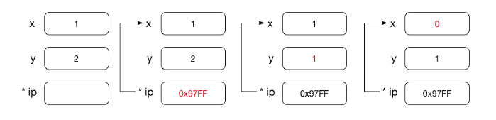
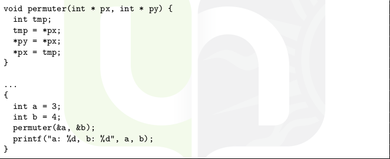

# Pointeurs

Les pointeurs ont un type:

* Si int, la valeur pointée doit être un nombre

```C
int x = 1, y = 2;
int * ip;

ip = &x; /* ip pointe maintenant sur x */
y = *ip; /* y est maintenant 1 */
*ip = 0; /* x est maintenant 0 */
```



Si on veut accéder à la valeur pointée (dans une fonction par exemple), on met le symbole &.




# Allocation dynamique

Utilisation de *malloc*.

# Structures (listes chaînées)

Il s'agit de la même chose qu'une classe en Python mais sans les fonctions. En gros, c'est dire que tous les éléments appartenant à une même structure auront les mêmes caractéristiques. On utilise les structures comme "équivalent" des dictionnaires Python.

```C
//Définir la structure(/classe) étudiant.
struct etudiant
{
    //Chaque étudiant qui sera ajouté aura un nom, un âge et une année.
    char nom[50];
    int age;
    int annee;
};

struct etudiant liste[10]; //Initialise une liste de 10 étudiants avec chacun ses caractéristiques particulières.

struct etudiant etudiant1 = {"Toto", 19, 3}; //Initialise l'étudiant 1 dont le nom est Toto, l'âge 19 et l'année 3.
```

```C
struct etudiant
{
    char nom[50];
    int age;
    int annee;
    struct etudiant * suivant; //Pointeur, permet de faire le lien entre les structures de données
};

struct etudiant * tete, * suivant;

// Allocation dynamique
tete = (struct etudiant *) malloc(sizeof(struct etudiant));
(*tete).age = 18;
(*tete).annee = 2009;
(*tete).suivant = NULL;

(*tete).suivant = (struct etudiant *) malloc(sizeof(struct etudiant));
suivant = (*tete).suivant;

(*suivant).age = 19;
(*suivant).annee = 2008;
(*suivant).suivant = NULL;

// Libération de mémoire après l’utilisation
free(tete);
free(suivant); //ou free((*tete).suivant);
```

## Types de listes chaînées

* liste simplement chaînée
* liste doublement chaînée
* liste circulaire

## Opérations sur les listes

* Création d’un élément à la tête, à un endroit quelconque ou à la
queue d’une liste.
* Suppression d’un élément d’une liste.
* Recherche d’un élément d’une liste.

