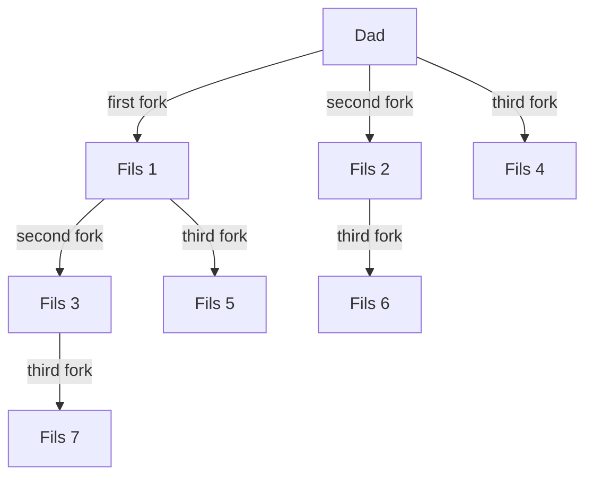
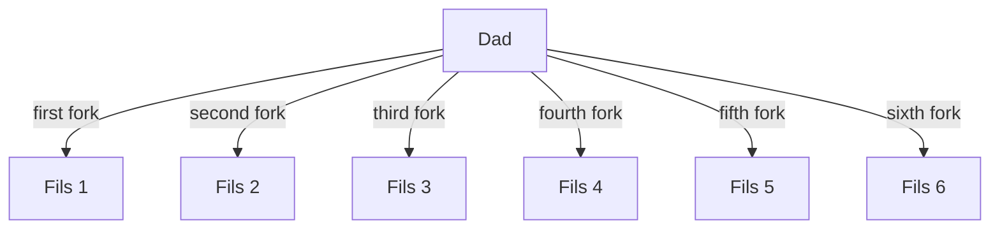

# Random notes on C
## by Antoine Mouchet

## _*Note*_

Ce document n'est probablement pas parfait et contient peut-être encore des erreurs. N'hésitez pas à me les signaler si vous en trouvez pour que je les corrige. 

L'utilisation de gdb quand on utilise le signal SIGRTMIN est à **PROSCRIRE** car il remplace sa valeur créant un conflit et cassant tout.

!!!info
    Par convention, en C, une chaine de caractères finira toujours par le caractère '\0'.

## _*Les librairies*_

Un truc super important qu'il faut pas oublier, ce sont les librairies//headers.
Voici une liste (non-exhaustive et qui sera mise à jour au fur et à mesure) des librairies utilisées en permanence actuellement:
```C
// Librairie générale
#include <stdlib.h>
// Input et Output en C (printf inclus ici)
#include <stdio.h>
// Manipulations de chaines de caractères
#include <string.h>
// Processus et threads principalement
#include <sys/types.h>
// Faciliter l'accès aux informations sur les fichiers
#include <sys/stat.h>
// Processus et diverses fonctions & constantes
#include <unistd.h>
// Manipulations de fichiers
#include <fcntl.h>
// Pour rapporter les codes d'erreurs de certaines librairies
#include <errno.h>
// Processus
#include <sys/wait.h>
// Récupération et gestion de signaux
#include <signal.h>
```


## _*Un peu de syntaxe*_

Le ```;``` est nécessaire après chaque déclaration et assignation et à la majorité des fins de lignes. Le seul moment où il n'est pas nécessaire est au moment de la déclaration d'une fonction.

### _Assignation et déclaration de variable_
Lorsqu'on connaît la valeur de départ d'une variable, on peut la déclarer et lui assigner directement cette valeur.
```C
int amount, result = 0;
```
Dans l'exemple ci-dessus, on ne connait pas la valeur de départ d'```amount``` mais bien celle de ```result``` qui est de 0.

### _Définition et appel de fonction_
Lorsque l'on définit une fonction en C, il est important de préciser son type de retour avant son nom et de préciser le type des paramètres demandés.
```C
int sum(int firstNumber, int secondNumber)
{
    return firstNumber + secondNumber;
}
```
Par contre, lors de l'appel de la fonction, il n'est plus nécessaire de préciser le type passé en argument.
```C
int main(void)
{
    // Déclaration de 2 variables qui sont de types entiers
    int x = 5;
    int y = 6;
    // Déclaration de la variable qui va stocker le résultat de la fonction somme
    // Type entier comme mis devant la définition
    int result;

    // Appel de la fonction et récupération du résultat.
    result = sum(x, y);

    // Par convention, un programme C qui se termine sans erreur renvoie la valeur 0.
    return 0;
}
```


### Static
#### Pour une fonction ou une variable globale

L'utilisation du mot clé ```static``` devant la déclaration d'une fonction ou d'une variable globale (définie en dehors de toute fonction) permet de limiter l'usage de celle-ci uniquement au fichier dans lequel elle se trouve.
```C 
// Variable globale accessible uniquement dans ce fichier.
static int first;

// Fonction accessible uniquement dans ce fichier.
static void display(void)
{
    printf("Hello World!");
}
```
#### Avec les variables dans une fonction
Une variable déclarée dans une fonction sera supprimée de la mémoire à la fin de son exécution **SAUF** si la déclaration de la variable est précédée du mot ```static```.

```C 
int test(void)
{
    // Je déclare ma variable pour la conserver
    static int number = 0;

    // J'incrémente ma variable de 1
    // Équivalent à number += 1 en Python
    number ++;
    return number;
}
int main(void)
{
    printf("%d", test()) // Le résultat de ce print sera 1
    printf("%d", test())
    // Le résultat du second print sera 2
    // car la variable number a gardé la valeur 1 après
    // le premier appel à test().

    return 0;
}
```

### _Nommage des variables_
\
Il faut utiliser le moins possible le ```_``` dans le nom des variables.

!!!tip Note
    Apparemment, il n'y a pas de convention de nommage officielle en C. Ce point est donc totalement négligeable et ne reflète que mon opinion.

```C 
int NbEnfants;
```

est **mieux** que

```C 
int nombre_enfants;
```
De manière générale:
* camelCase pour les variables/fonctions
* PascalCase pour les structs
* JE_SUIS_PAS_CONTENT_CASE pour les constantes

### _Variable compteur dans une boucle for_
\
Lors de l'utilisation d'une boucle ```for```, si l'on a besoin d'une variable compteur, il n'est pas nécessaire de la déclarer avant la boucle même. En effet, l'écriture suivante est tout à fait acceptable.
```C
for (int i = 0; i < 5; i++)
{
    // Instructions de la boucle ici
}
```

### _Les commentaires_

Les commentaires sont **EXTRÊMEMENT** importants, ils permettent aux autres personnes travaillant sur votre code de comprendre votre raisonnement et pourquoi vous faites les choses d'une façon plutôt que d'une autre. Il faut toujours laisser un espace entre les signes annonçant le début du commentaire et mettre une majuscule (*en vrai c'est pas obligatoire mais c'est mieux et ça rend le code plus lisible*). En C on distingue 2 manières de les faire.

#### Version 1: multi-lignes
```C
/* Ceci
est un commentaire
sur plusieurs lignes.
*/
```
#### Version 2: mono-ligne
```C
// Ici c'est ligne
// Par ligne
// Qu'il faut le faire.
```


### _scanf()_

Lors d'un ```scanf```, on doit désigner l'adresse de l'endroit où la valeur va être stockée. C'est pour cela que l'on différencie un ```scanf``` avec un string d'un ```scanf``` avec un int.

Il est important de noter que ```scanf``` ne fait que récupérer la valeur introduite par l'utilisateur, elle n'affiche rien. Dès lors, il est intéressant de montrer à l'utilisateur avec un ```printf``` ce qu'on veut qu'il mette.
```C
#include <stdio.h>
#include <stdlib.h>
#include <string.h>

int n;
char sentence[20];
char letter;

// Ici je veux le nombre
printf("Insert a number.\n");
scanf("%d", &n);

// Par contre là c'est la chaîne de caractères
// Attention qu'une chaîne de caractères demandée comme suit sera arrêtée au premier espace
printf("Insert a string.\n");
scanf("%s", sentence);

// Ici je voudrais uniquement une lettre.
// 2 méthodes donnent le même résultat
printf("Insert a letter.\n");
letter = getchar();
scanf(" %c", &letter);
// L'espace avant le % est important pour éviter de prendre les caractères blancs.
```

### _Utilisation des conditions_

En c, on a à notre disposition ```if```, ```else if``` et ```else```.

Rien de mieux qu'un exemple pour montrer leur utilisation:
```C
#include <stdlib.h>
#include <stdio.h>

int main(void)
{
    // On déclare juste un nombre ici.
    int number;

    // On récupère le chiffre tapé par l'utilisateur.
    printf("Give me a number!\n");
    scanf("%d", &number);

    // Première condition
    if (number == 0)
    {
        printf("Ton nombre il est nul.\n");
    }
    // On ne vérifiera cette condition que si la première n'est pas vraie.
    else if (number < 0)
    {
        printf("Il faut arrêter d'être négatif maintenant.\n");
    }
    // On passe ici que si aucune autre condition est vrai.
    else
    {
        printf("Tu es positif malgré que tu as déjà raté 2 tests?!\n");
    }
    return 0;
}

```

### _Valeurs de vérités et opérateurs_

En C,  la valeur ```False``` est représentée par le ```0``` (```True``` par ```1``` du coup (*bah oui logique*)).

| Opérateur | Symbole  |
| :-------: | :------: |
|    AND    | ```&&``` |
|    OR     | ```||``` |
|    NOT    | ```!```  |

L'opérateur ```NOT``` permet de vérifier qu'une valeur est fausse.\
Ainsi, dans l'exemple conditionnel ci-dessus les notations suivantes sont équivalentes:
```C
if (number == 0)
```

```C
if (!number)
```
### _switch()_
```switch``` est une sorte de fonction de gestion de cas en fonction des différentes valeurs que peut prendre une variable.

Voici un exemple:
```C
#include <stdio.h>

int main (void)
{
    switch (choix) 
    {
        // Quand choix vaut 1, on passe ici
        case 1:
            printf("Ton choix est le nombre 1.\n");
            
            // Le break est important pour éviter que l'on passe
            // Dans default.
            break;

        // Quand il vaut 2 c'est par ici plutôt
        case 2:
            printf("Ton choix est le nombre 2.\n");

            // Même utilité que case 1
            break;

        // Le reste vient ici
        default:
            printf("Le reste passe par ici.\n");
    }
    return 0;
}
```

## _*Pointeurs*_

### _Valeurs fixes_
```C
int A;
int *P;
P = &A;
```
* ```A```   : le contenu de A.
* ```&A```  : l'adresse de A.
* ```P```   : l'adresse de A.
* ```*P```  : le contenu de A.

```C
int note = 9;
int *p;

p = &note;  // 1
*p = 25     // 2
```
| Identificateur | Adresse |    Valeur     |
| :------------: | :-----: | :-----------: |
|      note      |  5643   |  9 (après **2**: 25)  |
|       p        |  23967  | / (après **1**: 5643) |

### _Tableaux_

A est un tableau
i est l'indice

* ```A``` : l'adresse de A[0]
* ```A+i``` : l'adresse de A[i]
* ```*(A+i)``` : le contenu de A[i]

```P = A```
* ```P``` pointe sur A[0]
* ```(P+i)``` pointe sur A[i]
* ```*(P+i)``` donne le contenu de A[i]

### _Allocation dynamique_
Pour allouer de la mémoire de manière dynamique  (typiquement à un pointeur), on utilise ```malloc``` et ```sizeof```. Il ne faut pas oublier de libérer cet espace à la fin avec ```free```.

```C
int *p;
// Attribution de mémoire dynamique au pointeur d'entier
p = malloc(sizeof(int));

// Libération de la mémoire réservée.
free(p);
```

## _*Structures*_
Il est possible de créer ses propres structures de données avec des caractéristiques différentes en fonction de chaque structure (*on peut le voir comme une classe en python un peu*).

### _Code pour une structure_

Voici le code d'initialisation des structures date, étudiant et année d'étude. 
```C 
// Structure date
struct date
{
    int day;    // Jour
    int month;  // Mois
    int year;   // Année
}

// Structure étudiant
struct student
{
    char name[20]; // Le nom de l'étudiant est de 20 caractères maximum.
    struct date birthDate; // La date de naissance de l'étudiant.
};

// Structure année d'étude
struct studyYear
{
    char code[10];  // Code de l'année et des études
    struct student listStudent[25];
    // On déclare une liste de structures étudiants.
    // Chaque élément de cette liste est un étudiant.
}
```


Maintenant que tous les types sont déclarés, on peut créer des variables de chaque type et modifier leurs valeurs avec l'accès par caractéristique.

```C 
// Déclaration d'une variable classe de type studyYear.
struct studyYear classe;

// Je change la caractéristique "code" de cette classe
// pour la mettre à la valeur voulue.
classe.code = "Bac2-Info";

// Ici je modifie le nom du 3ème étudiant (on commence avec index 0)
classe.listStudent[2].name = "Dupont";

// Ici je modifie le jour d'anniversaire du 3ème étudiant
classe.listStudent[2].birthDate.day = 21;

// Je déclare le délégué entièrement.
// Nom = Dupont
// Date de naissance = 12/05/1992
struct student delegue = {"Dupont", {12, 05, 1992}};

// Il est possible de copier une autre structure
struct student representant;
representant = delegue
```
Une fois qu'un type est déclaré, on peut l'utiliser pour tout. Ainsi, il est possible d'avoir une fonction qui renvoie une valeur d'un type personnalisé.
```C
struct student resultVote(char code[15])
{
    // La variable qui récupère le vainqueur
    struct student winner;

    // Faire des trucs ici

    return winner
}

struct student delegue = resultVote("2e-Bac-Info")
```
### _Listes chaînées_
Il s'agit d'un assemblage de cellules liées par des pointeurs.

```C
struct element
{
    // Caractéristiques de l'élément
    type valeur;

    // Pointeur vers l'élément suivant
    struct element *next;
}
// Je déclare un pointeur sur la variable liste qui est
// une structure d'élément avec un pointeur sur l'élément suivant.
struct element *list;
```

### _Listes doublement chaînées_
Il s'agit d'un assemblage de cellules liées par des pointeurs avec un chaînage dans les 2 sens.

```C
struct element
{
    // Caractéristiques de l'élément
    type valeur;

    // Pointeur vers l'élément précédent
    struct element *previous;

    // Pointeur vers l'élément suivant
    struct element *next;
}
// Je déclare un pointeur sur la variable liste qui est
// une structure d'élément avec un pointeur sur l'élément suivant.
struct element *list;
```
### _Arbres binaires_
On a un chaînage bi-dimensionnel

```C
struct node
{
    // Caractéristique de l'élément
    type valeur;

    // Pointeur sur l'élément à gauche
    struct node *left;

    // Pointeur sur l'élément à droite
    struct node *right;
}
// Déclaration du pointeur sur l'arbre
struct node tree;
```

!!! attention
    L'opérateur ```.``` est prioritaire sur ```*```. Dès lors, il ne faut pas hésiter à utiliser les parenthèses.\
    Il est également bon de noter ceci:
    
    pointeur -> champ $\equiv$ (*pointeur).champ


Voici différents exemples
```C
// Déclaration du type liste chainée
struct element
{
    int value;
    struct element *next;
}
// Déclaration d'un pointeur sur une variable qui est une liste chainée.
struct element *liste;

// Je change la valeur de l'élément sur lequel la liste pointe.
(*liste).value = 5;

// Je mets le pointeur sur l'élément suivant (aucun ici)
liste -> next = NULL;
 
```

Avec des fonctions
```C
// Déclaration du type
struct cellule
{
    int value;
    struct cellule *next;
}

// Déclaration d'une fonction qui renvoie une liste chainée
struct cellule *create(int n)
{
    // Déclaration variable compteur
    int counter;
    // Déclaration de listes chainées
    struct cellule *p, *q;

    compteur = n + 1;
    // La valeur de p est NULL
    p = NULL;

    while(compteur > 1)
    {
        // Attribution de la mémoire
        q = malloc(sizeof(struct cellule));

        // Change la valeur de q
        q -> value  = i -1;

        // Change le pointeur de q
        // L'élément suivant de la liste devient p
        q -> next = p;

        // En faisant ceci, la valeur de p devient celle de q actuellement
        // On crée ainsi une chaine en partant du dernier élément.
        p = q;

        // Décrémente i pour éviter la boucle infinie
        i = i - 1;

    }

    // On retourne la liste chainée complète
    return p
}

// Insertion à la fin de la liste
void insertEnd(int n, struct cellule *p)
{
    struct cellule *q, *r;

    // r sera la dernière cellule de notre liste
    r = malloc(sizeof(struct cellule));
    r -> value = n;
    r -> next = NULL;

    // Si la liste est vide
    if (p == NULL)
    {
        // La liste devient le nouvel élément
        p = r;
    }
    else
    {
        // On fait une copie de p pour ne pas modifier la valeur
        // sur laquelle p pointe.
        q = p;
        // On regarde si l'élément suivant est la fin
        while (q -> next != NULL)
        {
            // On avance de 1 dans la liste
            q = q -> next;
        }
        // On a atteint la fin
        q -> next = r;
    }
}
```

Avec un arbre maintenant
```C
// Déclaration du type
struct node
{
    // Caractéristique du type node
    int value;

    // Pointeurs sur les autres arbres
    struct node *left;
    struct node *right;
}
// Fonction qui fait la somme des éléments de l'arbre.
int sumTree(struct node *tree)
{
    // Si l'arbre est vide, renvoie 0
    if (tree == NULL)
    {
        return 0;
    }
    else
    {
        // Calcul de la somme des arbres gauches et droits
        // et ajout de la valeur de cette node.
        return sumTree(tree -> left) \
        + tree -> value \
        + sumTree(tree -> right);
    }
}
```

## _*Processus*_

Ça sert à quoi ce truc? Et bien c'est pour diviser le travail en quelque sorte.
Le père, qui a la flemme, va faire des gosses (*pas pour les allocs mais pour les mettre au travail ici*) et il va soit travailler de son côté (*Ouais ouais ça lui arrive*), soit attendre que les gosses aient fini leurs tâches respectives.

_Mais comment on fait des enfants me direz-vous?_\
(*Je pourrais répondre demande à tes parents mais pas sûr qu'ils puissent aider*)\
C'est pas très compliqué pour le coup. On peut distinguer plusieurs manières de les faire selon:
* L'arbre familial voulu.
* Le nombre de fils à créer.

Avant de se lancer dans la description des différentes méthodes, il me semble important de parler de la valeur de retour de ```fork()``` ainsi que du ```pid```. 

### _fork()_

```fork()``` est la fonction qui permet la création d'un processus.
Elle renvoie une valeur de type ```pid_t```. Ce type désignant un entier signé, il est tout à fait correct de déclarer la variable dans laquelle est stockée la valeur de retour du fork comme un type ```int```.\
Les valeurs de retour possibles sont:
* 0: on est alors dans le processus fils.
* \> 0: on est dans le processus père.
* -1: il y a eu une erreur lors de la création du processus.

Voici un code C pour créer un processus et définir dans quel processus on est:

```C
#include <stdio.h> 
#include <sys/types.h> 
#include <unistd.h>
#include <errno.h>

int main(void)
{
    // Je déclare la variable de retour du fork
    int forkReturn;

    // Ici, on crée le processus fils mais en plus
    // On stocke la valeur de retour dans la variable forkReturn.
    forkReturn = fork();

    // Child case
    if (forkReturn == 0)
    {
        printf("Ici c'est le fils!\n");
    }

    // Parent case
    else if (forkReturn > 0)
    {
        printf("Voilà le père.\n");
        printf("La valeur forkReturn: %d est le pid de mon fils.", forkReturn);
    }

    // Error
    else
    {
        // La fonction perror affiche un message d'erreur à la suite
        // De la chaîne de caractères déjà présente.
        perror("An error occured: ");

        // Cette ligne permet de terminer le programme en montrant 
        // Qu'il y a eu une erreur.
        return 1;
    }

    return 0;
}
```
### _PID_

Le ```pid``` d'un processus est son numéro d'identification. On l'obtient avec la fonction ```getpid()```. Pour obtenir le ```pid``` du père, on utilise la fonction  ```getppid()```.\
(*La réflexion fut intense du côté des développeurs pour le nom de cette dernière.*)

### _2^n - 1 fils_
Dans le cas où l'on veut $2^n-1$ fils, il suffit de mettre $n$ fork() les uns à la suite des autres.


Le code C qui donne l'arbre ci-dessus est le suivant:

```C
#include <stdio.h> 
#include <sys/types.h> 
#include <unistd.h> 

int main(void) 
{ 
    fork();
    fork();
    fork();

    return 0;
}
```

Le problème de ce code est que la structure de l'arbre est définie et qu'en plus, vu qu'on ne récupère par la valeur renvoyée par ```fork```, on ne peut pas savoir dans quel processus on est ou même s'il y a eu un problème lors de la création.

Pour créer des arbres plus spéciaux ou obtenir un nombre de fils différent, il faut donc utiliser une autre méthode. Il en existe plusieurs, encore une fois cela dépend de la structure d'arbre que l'on veut.

### _Plusieurs fils même père_


(*Oui, une telle productivité est possible...*)

Le code C suivant peut donner ce genre d'arbre

```C
#include <stdio.h> 
#include <sys/types.h> 
#include <unistd.h> 

int main(void) 
{
    // On déclare la variable où on va mettre la valeur de retour du fork
    // Et un tableau de 6 entiers (il contiendra les valeurs de forkReturn).
    int forkReturn, ProcessID[6];

    // On boucle tant que les 6 enfants n'ont pas été faits et on ajoute
    // Une condition qui permet de vérifier que seul le père crée des enfants.
    for (int i = 0; i < 6 && id = 0; i++)
    {
        // On stocke la valeur de retour du fork
        // À l'emplacement i du tableau ProcessID
        ProcessID[i] = fork();

        // Ici c'est un enfant, on ne veut pas qu'il ait d'enfant donc
        // On le fait sortir de la boucle en changeant la valeur de id.
        if (ProcessID[i] == 0)
        {
            id = 1;
        }

        // N'oublions pas de gérer le cas potentiel de l'erreur.
        else if (ProcessID[i] < 0)
        {
            perror("An error occured: ");
        }
        // Mettre une condition pour le père n'aurait pas de sens ici car il ne fait
        // Rien.
        // On veut juste qu'il recommence la boucle pour recréer d'autres enfants.
    }

    return 0;
}
    
```
## _*Fichiers*_
### _Différence entre ```fopen()``` et ```open()```_
_*Source:*_ [Stack Overflow](https://stackoverflow.com/questions/1658476/c-fopen-vs-open)

Il y a 4 raisons principales pour préférer ```fopen()``` (librairie) à ```open()``` (appel plus bas niveau).:
1. ```fopen()``` donne un buffer I/O qui est beaucoup plus rapide que l'utilisation d'```open()```.
   
2. ```fopen()``` effectue une traduction de fin de ligne si le fichier n'est pas ouvert en mode binaire, ce qui peut être très utile si votre programme est porté dans un environnement non-Unix (bien que le monde semble converger vers le mode LF uniquement (sauf les protocoles de réseau en mode texte de l'IETF comme SMTP et HTTP et autres)).

3. Un ```FILE *``` vous donne la possibilité d'utiliser ```fscanf()``` et d'autres fonctions stdio.

4. Votre code devra peut-être un jour être porté sur une autre plateforme qui ne supporte que l'ANSI C et ne supporte pas la fonction ```open()```.

!!!info
    Dans ce document, j'utilise souvent ```open()``` mais tous les codes utilisant cette fonction sont adaptables pour utiliser ```fopen()```. C'est cette dernière fonction qui est la plus employée actuellement dans des applications.

### _Utilisation de ```fopen()```_
!!!quote Remerciement
    Cette partie m'a été expliquée par Vincent Higginson

#### Ouvrir un fichier
On commence par ouvrir le fichier (déclaration à l'OS qu'on prend la main dessus).\
Ensuite, on va chercher la longueur du fichier (```fseek()``` au début et à la fin, position = longueur).\
Après, On alloue un buffer de taille égale à la longueur du fichier.\
L'étape suivante est l'itération sur tous les caractères du fichier que l'on met dans le buffer à chaque fois.\
Enfin, on ferme le fichier.

```C
// Fonction affichant le contenu du fichier pointé par *path
void readFile(char *path)
{
    FILE *fp;
    fp = fopen(path, "r");
    long fileSize = 0;

    // Place pointer at end of file
    fseek(fp, 0L, SEEK_END);
    // Get size of file
    fileSize = ftell(fp);

    // Return to start of file
    fseek(fp, 0L, SEEK_SET);

    // Alloc size for file
    char *buff = (char *)malloc(fileSize * sizeof(char));
    fread(buff, fileSize, 1, fp);

    // Print content of file
    printf("%s", buff);

    // Close file
    fclose(fp);
}
```

## _*Signaux*_
Les signaux permettent de prévenir un processus qu'un événement particulier s'est produit. C'est un peu le moyen de communication entre processus au final. Les processus ont un comportement adapté en fonction de chaque signal. Il est possible de modifier ce comportement en utilisant la fonction ```sigaction``` avec les paramètres appopriés.

!!!example Exemple
    ```C
    // Variable globale
    int NbAlarm = 0;

    /*
    Fonction permettant de changer l'action faite lorsque le signal précisé par signum est reçu.
    */ 
    void handler(int signum)
    {
        //increment nb alarms and print amount of times it was already printed
        NbAlarm ++;
        printf("Number of alarms: %d.\n", NbAlarm);
    }

    int main(int argc, char const *argv[])
        // Modify action of sigalrm and ignore all signals except it

        // Structure qui va être utilisée pour remplacer l'ancienne action
        struct sigaction act;
        // Ensemble de signaux
        sigset_t set;
        
        // Définit la nouvelle méthode de gestion du signal
        act.sa_handler = handler;
        act.sa_flags = 0;

        // Remplace l'ancienne action par la nouvelle (définie par act)
        sigaction(SIGALRM, &act, NULL);

        // On dit ici que l'ensemble des signaux les reprend tous
        sigfillset(&set);
        // On supprime le signal SIGALRM de l'ensemble
        sigdelset(&set, SIGALRM);

        // Bloque les signaux de l'ensemble set (donc tous sauf SIGALRM).
        sigprocmask(SIG_SETMASK, &set, NULL);
    ```

### _Question 1: Que se passe-t-il si le processus père envoie le signal SIGSTOP au lieu de SIGUSR1 ? La situation est-elle différente avec le signal SIGINT?_
!!!question Réponse
    Le signal SIGSTOP ne peut pas être ignoré. Donc lorsque le père envoie ce signal au fils, celui-ci va s'arrêter.\
    Le signal SIGINT peut être ignoré donc cela n'arrêtera pas le fils car on a réattribué une action à SIGINT.

### _Question 2: Comment améliorer un programme pour que le processus père ne soit pas interrompu lorsque l’on tape un CTRL-C?_
!!!question Réponse
    On implémente une fonction ```handler``` dont le but va être de changer l'action de SIGINT (signal de CTRL-C) afin que celui-ci soit ignoré. On attribuera cette fonction UNIQUEMENT au signal SIGINT en utilisant la fonction ```sigaction```.


## _*Pipes*_

On utilise des ```pipes``` *(ou tubes en français)* pour connecter un flux de données entre des processus *(bien plus pratique et propre que les signaux*) afin de se transmettre de l'information.

On distingue 2 types de ```pipes```:
* pipe simple $\Rightarrow$ Données entre processus d'un même programme.
* pipe nommé $\Rightarrow$ Données entre processus de différents programmes car se comporte comme un fichier.

!!!example Exemple pipe simple
    ```C
    #include <stdio.h>
    #include <stdlib.h>
    #include <string.h>
    #include <unistd.h>
    #include <sys/types.h>

    int main(int argc, char const *argv[])
    {
        // Array for pipe
        int fdPipe[2];

        // Create pipe
        int pipeReturn = pipe(fdPipe);

        // Check if there was an error creating pipe
        if (pipeReturn == -1)
        {
            // Display error and exit program
            perror("Error creating pipe");
            return 1;
        }

        // Create child process
        int forkReturn = fork();
        
        // Error case
        if (forkReturn < 0)
        {
            // Display error and exit program
            perror("Error creating process");
            return 1;
        }
        // Parent case
        else if (forkReturn > 0)
        {
            // Initialize data to send
            char data[] = "je t'envoie des données";
            // Initialize nb of bytes sent by process
            int nbBytes = 0;

            // Close the reading end of the pipe for the parent
            // We want to send data not read some here
            close(fdPipe[0]);

            // Send data
            // Writing end of pipe is at 1 in the array
            nbBytes = write(fdPipe[1], data, strlen(data));

            // Close writing end of pipe now that we sent data
            close(fdPipe[1]);

            // Display number of bytes sent and pid.
            printf("I'm the parent. My pid is: %d and I sent %d bytes.\n", getpid(), nbBytes);
        }
        // Child case
        else
        {
            /* The child inherited the same pipe as the parent process
            except that both ends are still open for the child.*/

            // Initialize array for data to receive
            char received[100];
            // Initialize command to execute
            char command[256];
            // List of argument for command
            char arg[3][100];

            // Close writing end of pipe
            // Receiving data not sending
            close(fdPipe[1]);
            
            // Read data from pipe and store it into array received
            read(fdPipe[0], received, 100);
            // Terminate string
            received[strlen(received)] = '\0';

            // Close reading end of pipe 
            // Data was received
            close(fdPipe[0]);

            // Command name
            strcpy(arg[0], "od ");
            // Option
            strcpy(arg[1], "-c ");
            // Data
            strcpy(arg[2], received);
        
            // Build command using format
            sprintf(command, "%s%s\"%s\"", arg[0], arg[1], arg[2]);

            printf("%s\n", command);
            // Actually use command
            system(command);
        }
        return 0;
    }
    ```

!!!example Exemple pipe nommé
    ```C
    //Création du pipe nommé (chemin du fichier, permissions)
    int pipeReturn = mkfifo("./", 0666);
    // Check that named pipe was correctly created
    if (pipeReturn == -1)
    {
        perror("Error creating pipe to get request");
        return 1;
    }

    // OPEN NAMED PIPES
    // Get request so read only (path to file, mode)
    int pipeReqDescriptor = open(GET_REQ, O_RDONLY);

    // Check it opened correctly
    if (pipeReqDescriptor == -1)
    {
        perror("Error opening named pipe to get request");
        return 1;
    }
    ```

## _*Thread*_
### _Différence entre thread et processus_

Il y a des accès concurrent à un objet partagé avec:
* **_Les threads:_** Ils ont un espace d’adressage commun, des accès concurrents aux variables globales et aux fichiers ouverts.
* **_Les processus (*parents & enfants*):_** Ils ont un espace d’adressage distincts mais partagent la mémoire et les fichiers ouverts avant le fork.

### _Message passing_
Le **message passing** c’est le fait d’envoyer des messages entre des entités. Il peut être local (entre threads d’une machine) ou non-local (entre deux machines distantes)

### _Autres notions_
#### Section critique
Il s’agit de délimiter le code manipulant un objet partagé. On va instaurer une réglementation des entrées dans cette section.\
Conditions requises :
* ```Exclusion mutuelle``` : 2 threads ne peuvent pas être en section critique en même temps.
* ```Absence d’attente injustifiée``` : 1 thread hors de section critique ne peut empêcher l’entrée d’un autre.
* ```Absence de famine``` : pas d’attente infinie à l’entrée d’une section critique.
  
On veut une solution indépendante du matériel disponible (*vitesse et nombre de processeurs*). Il n’y a pas d’exécutions out-of-order de processeur.
#### Solution avec attente active
##### Variable verrou
On utilise une variable partagée qui sert de verrou. Elle prend les valeurs :
* ```Ouvert``` : aucun thread n’est en section critique.
* ```Fermé``` : un autre thread est en section critique.
  
L’accès à la section critique se fait lorsque le verrou est ouvert. Tant que celui-ci est fermé, on attend en vérifiant régulièrement la valeur du verrou. Dès que celui-ci est ouvert, le thread entre en section critique et met à jour le verrou pour le fermer.

!!!failure
    L’exclusion mutuelle n’est cependant pas garantie car le verrou est accessible à tous et peut être modifié par d’autres thread.


##### Alternance stricte
On utilise une variable partagée ```tour```. De plus, on attribue à chaque thread un identifiant. L’entrée en section critique ne sera permise qu’au thread qui a le bon identifiant.

L’accès en section critique se fait de la même manière que pour un verrou. À la sortie, on incrémente la variable tour de 1, permettant ainsi au thread suivant de rentrer en phase critique.

!!!failure
    Il est possible d’avoir une attente injustifiée.
##### Alternance
On utilise un ```tableau partagé``` au lieu d’une simple variable. Cela empêche un thread de se retrouver à attendre qu’un autre thread dont c’est le tour arrive. Chaque élément du tableau peut prend 2 valeurs :
* Critique : entrée ou en section critique.
* Ailleurs : totalement hors de la section critique.

Cela nécessite également l’attribution d’un identifiant à chaque thread. L’accès à la section critique ne se fait que si aucun autre processus n’a le statut critique. À la sortie de la section critique, on bascule la valeur à ailleurs.

!!!failure
    On a quand-même toujours le risque d’attente infinie dans le cas où 2 threads atteignent l’état critique en même temps.

##### Solution de Peterson
C’est une combinaison des 2 dernières.

Lorsqu’un accès a lieu :
* Basculement à ```critique``` et passage de ```tour``` à ```autre```.
* Tant que ```tour``` de ```autre``` est à ```critique``` :
    * Attente active
    * Sinon entrée en section critique
* Sortie de section critique : basculement à ```ailleurs```.

!!!success
    C’est une solution correcte car elle remplit toutes les conditions.


#### Solutions avec blocage
##### Sémaphores
Mécanisme basé sur une variable entière s tel que $0\leq s$.

Il y a une liste d’attente du sémaphore pour les threads bloqués.

* Opération atomique  proberen(s) *(du néerlandais « essayer »)*
	* Si s == 0, ajout en liste d’attente, blocage.
	* Si s>0, décrémentation de s de 1 unité.
* Opération atomique verhogen(s) *(du néerlandais « incrémenter »)*
	* Si la liste d’attente est vide, on incrémente s de 1 unité.
	* Sinon on débloque un thread de la liste.
##### Mutex
C’est une version particulière du sémaphore. Il est basé sur une variable entière m\ tq $0\leq s$.

Liste d’attente du mutex pour les threads bloqués.

* On a l’opération atomique lock(m)
	* Si s==0, ajout en liste d’attente, blocage.
	* Si s==1, basculement de m à 0.
* On a également l’opération atomique unlock(m)
	* Si la liste d’attente est vide, on bascule m à 1.
	* Sinon, on débloque un thread de la liste.

### _Problèmes classiques_
Des problèmes classiques pour ces concepts sont les suivants:
* Producteur-consommateur
* Dîner des philosophes


## *_Sources_*
Je mets ici tous les sites qui m'ont été utiles à un moment quelconque dans l'écriture de ce document ou pour résoudre les divers exercices dans le cadre des TPs d'OS en plus des slides du cours d'OS et de Techniques de programmation.

### Processus
* [fork()](https://www.geeksforgeeks.org/fork-system-call/)
* [fork()](https://www.geeksforgeeks.org/creating-multiple-process-using-fork/)
* [fork()](https://www.geeksforgeeks.org/using-fork-produce-1-parent-3-child-processes/)
* [wait()](https://www.geeksforgeeks.org/wait-system-call-c/)
* [pstree](https://www.howtoforge.com/linux-pstree-command/#linux-pstree-command)
* [pstree](https://github.com/posborne/linux-programming-interface-exercises/blob/master/12-system-and-process-information/pstree.c)

### Fichiers
* [fopen()](https://www.tutorialspoint.com/c_standard_library/c_function_fopen.htm)
* [fseek()](https://www.tutorialspoint.com/c_standard_library/c_function_fseek.htm)
* [ftell()](https://www.tutorialspoint.com/c_standard_library/c_function_ftell.htm)
* [fread()](https://www.tutorialspoint.com/c_standard_library/c_function_fread.htm)
* [open()](http://codewiki.wikidot.com/c:system-calls:open)
* [open()](http://man7.org/linux/man-pages/man2/open.2.html)
* [stat()](https://www.ibm.com/support/knowledgecenter/en/ssw_ibm_i_72/apis/stat.htm)
* [stat()](https://linux.die.net/man/2/stat)
* [write()](https://linux.die.net/man/2/write)
### Signaux
* [sigaction()](https://www.ibm.com/support/knowledgecenter/ssw_ibm_i_74/apis/sigactn.htm)
* [sigaction()](http://man7.org/linux/man-pages/man2/sigaction.2.html)
* [signal()](http://man7.org/linux/man-pages/man7/signal.7.html)
* [sigqueue()](http://man7.org/linux/man-pages/man3/sigqueue.3.html)

### Multithreading
* [Dîner des philosophes](https://fr.wikipedia.org/wiki/D%C3%AEner_des_philosophes)
* [Multithreading in C](https://www.geeksforgeeks.org/multithreading-c-2/)

### Divers
* [Headers](https://www.ibm.com/support/knowledgecenter/ssw_ibm_i_74/apis/unix13.htm)
* [Liste chainée](https://www.geeksforgeeks.org/data-structures/linked-list/)
* [Tri liste](https://www.geeksforgeeks.org/c-program-bubble-sort-linked-list/)
* [mkfifo() ~ pipe nommé](http://man7.org/linux/man-pages/man3/mkfifo.3.html)
* [memcpy()](https://www.tutorialspoint.com/c_standard_library/c_function_memcpy.htm)
* [scanf()](https://stackoverflow.com/questions/14419954/reading-a-single-character-in-c)
* [Shell in C](https://brennan.io/2015/01/16/write-a-shell-in-c/)
* [sscanf()](https://www.tutorialspoint.com/c_standard_library/c_function_sscanf.htm)

